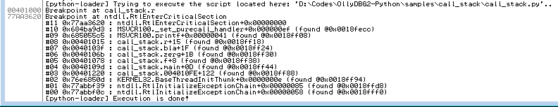

# Samples - Call_stack
Here the purpose is to show you the call stack display function. We have a binary with several nested calls, we put a breakpoint at the end and we check the call stack. To enhance the debugging experience, we even add some user label, sweet.

