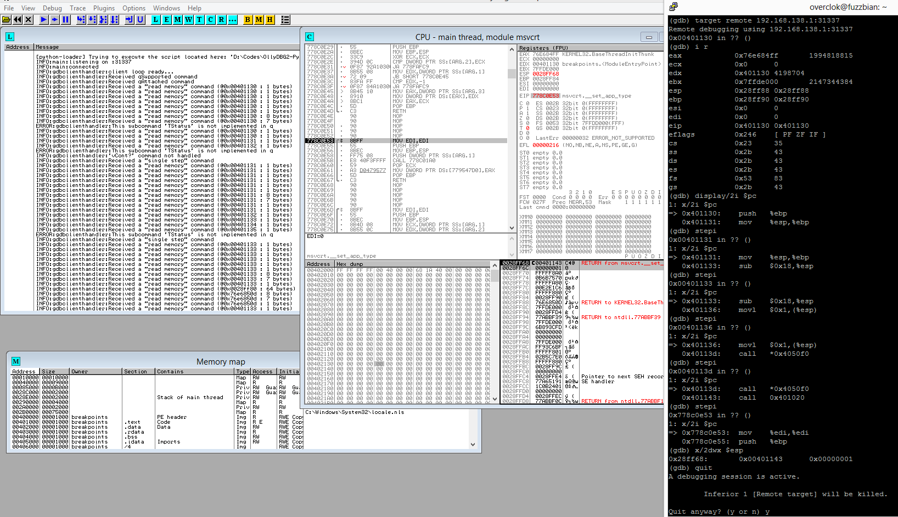

# Samples - gdbserver
Here is a really tiny(/buggy?) GDB stub server. The purpose is to control OllyDbg2 remotely with a GDB client: it can be GDB itself, or IDA for example.
Don't use it for doing real stuff, it's a fun PoC.

