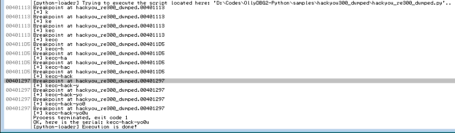

# Samples - hackyou300_dumped
This is a practical example of how you can use OllyDbg2-python to crack wide open CTF tasks. This example uses a breakpoint manager with a dispatch handler. Each time a specific breakpoint hits, a specific callback is called in order to retrieve some information, some states of the program.

